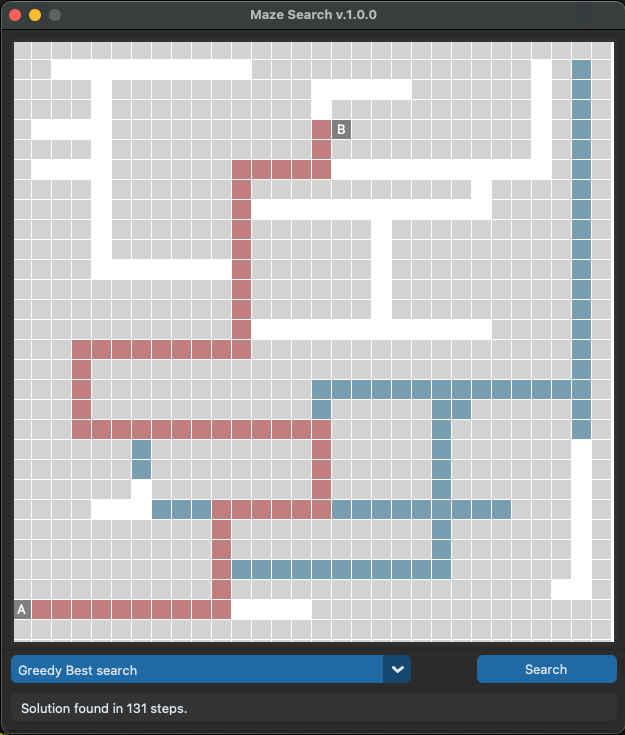

# maze
# A maze searching app with dynamically loaded search patterns

Installation: 

`pip install git+ssh://git@github.com/Barrowcroft/maze.git`

### Screenshot:

The program is written in Python using the CustomTKinter library. 
